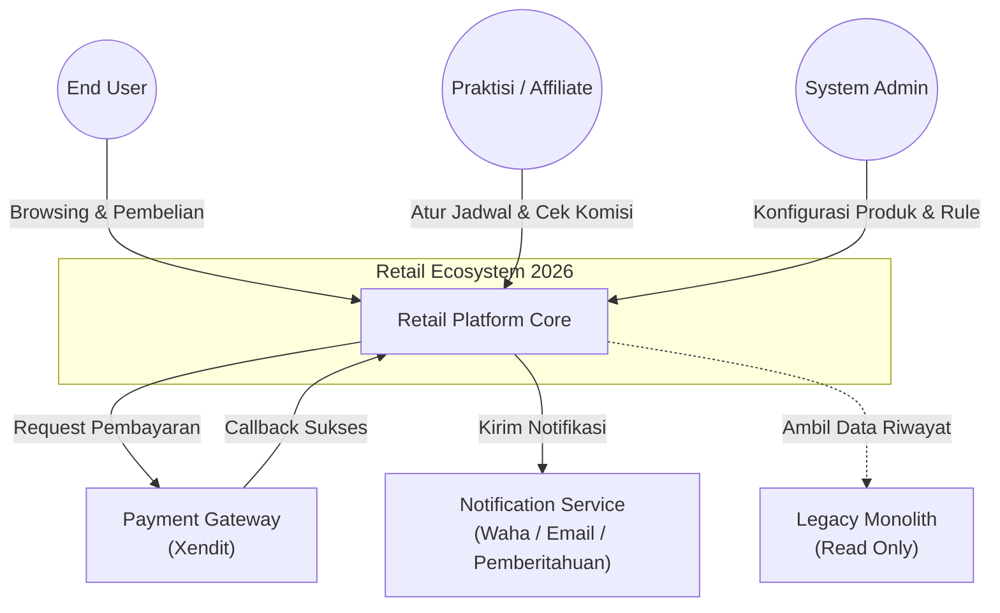
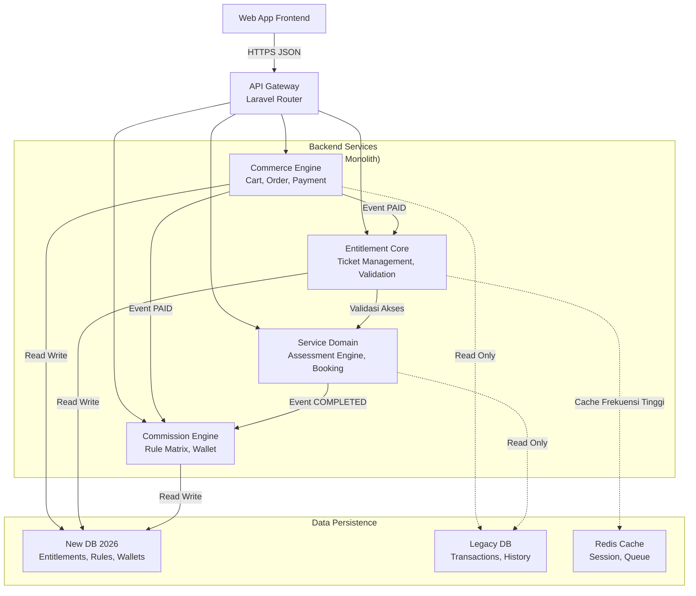

## 1. Garis Besar

Arsitektur Retail 2026 menandai transisi fundamental dari **Monolithic Transaction-Centric** menuju **Modular Service-Oriented**.

Perubahan kunci meliputi:

1. **Decoupling:** Pemisahan logika Keuangan (Commerce), Hak Akses (Entitlement), dan Operasional (Service).
2. **Scalability:** Penerapan *Asynchronous Processing* (Queue) untuk proses berat seperti kalkulasi komisi dan pelaporan.
3. **Hybrid Data:** Strategi database berdampingan di mana tabel Legacy tetap dipertahankan untuk integritas historis, sementara fitur baru berjalan di skema database modern yang memanfaatkan fitur **MySQL JSON Column** untuk fleksibilitas konfigurasi.

---

## 2. High-Level Design (HLD)

### 2.1. Context Diagram

Gambaran interaksi sistem Retail 2026 dengan aktor dan sistem eksternal.



### 2.2. Container Diagram

Membedah "Retail Platform Core" menjadi modul-modul fungsional.



**Penjelasan Komponen:**

* **Commerce Engine:** Menangani keranjang belanja, hitung harga, dan *interface* ke Payment Gateway.
* **Entitlement Core:** "Otak" sistem. Menyimpan status tiket. Modul lain harus bertanya ke sini sebelum melayani user.
* **Service Domain:** Logika bisnis spesifik (Soal Tes, Jawaban, Jadwal Konsul).
* **Commission Engine:** *Worker* di belakang layar yang menghitung bagi hasil berdasarkan *Rule Matrix*.

---

## 3. Technology Stack

Kami menggunakan stack yang **Robust, Mature, dan High-Performance** untuk ekosistem PHP.

| Komponen | Spesifikasi Teknologi | Alasan Pemilihan |
| --- | --- | --- |
| **Language** | **PHP 8.2+** | Fitur *Type Safety* dan performa JIT Compiler terbaik. |
| **Framework** | **Laravel 10.x / 11.x** | Ekosistem terlengkap (Queue, Event, Auth) untuk pengembangan cepat. |
| **Database** | **MySQL 8.0** | Dukungan *Native JSON Column* yang esensial untuk menyimpan *Commission Rules* yang dinamis. |
| **Cache & Queue** | **Redis** | In-memory datastore untuk validasi tiket super cepat dan antrian *job* komisi. |
| **Web Server** | **Nginx** | *High concurrency handling*. |
| **Frontend** | *Existing Stack* | (Menyesuaikan stack frontend saat ini, e.g., Blade/Vue/React). |

---

## 4. Database Strategy (Hybrid Architecture)

### 4.1. Strategi Koeksistensi (*Side-by-Side*)

Untuk memitigasi risiko migrasi, kita tidak mengubah tabel lama.

1. **Read-Reference:** Aplikasi baru membaca tabel `users` dan `transactions` lama untuk mengenali user lama.
2. **Write-New:** Semua logika baru (Tiket, Komisi Baru) ditulis ke tabel baru dengan prefix atau database terpisah.
3. **JSON Flexibility:** Tabel konfigurasi menggunakan kolom JSON untuk menghindari *Schema Altering* setiap kali ada aturan bisnis baru.

### 4.2. Skema Tabel Kunci (Simplified) (Draft)

**Tabel: `commission_rules` (MySQL 8.0)**
*Menyimpan logika matriks yang kompleks dalam satu kolom JSON yang indexable.*

```sql
CREATE TABLE commission_rules (
    id BIGINT PRIMARY KEY,
    name VARCHAR(255),
    priority INT, -- Untuk Override Logic

    -- Kolom Filter (Untuk Query Cepat)
    recipient_tier ENUM('MEMBER', 'PRACTITIONER', 'INFLUENCER'),
    product_variant_id BIGINT,

    -- Kolom Logika (JSON)
    -- Contoh isi: { "action": "referral", "base": "net_profit", "value": 0.15 }
    rule_config JSON,

    is_active BOOLEAN
);

```

**Tabel: `entitlements**`
*Pengganti pengecekan transaksi langsung.*

```sql
CREATE TABLE entitlements (
    id BIGINT PRIMARY KEY,
    user_id BIGINT, -- Relasi ke User Lama
    source_transaction_id BIGINT, -- Relasi ke Transaksi Lama/Baru

    product_sku VARCHAR(50),
    status ENUM('LOCKED', 'ACTIVE', 'SCHEDULED', 'COMPLETED', 'VOID'),

    valid_until DATETIME,
    metadata JSON -- Untuk menyimpan data tambahan (misal: jadwal booking)
);

```

---

## 5. Security Architecture

### 5.1. Autentikasi & Otorisasi

* **Authentication:** Menggunakan **Laravel Sanctum** (jika API-based) atau Session standar. User DB tetap menggunakan tabel `users` lama agar user tidak perlu reset password.
* **Authorization:** Menggunakan **RBAC (Role-Based Access Control)**.
* Setiap request ke API Service Domain harus melampirkan *Token*.
* Middleware `CheckEntitlement` akan memvalidasi apakah user memiliki tiket aktif di Redis/DB sebelum mengizinkan akses ke Controller.


### 5.2. Proteksi Data Sensitif

* **Data Gaji/Komisi:** Nilai nominal di tabel `wallet_ledger` bersifat rahasia. Akses ke tabel ini dibatasi hanya untuk *Service Commission* dan *Admin Finance*.
* **Anti-Tampering:** Tabel `wallet_ledger` harus bersifat *Append-Only* (Tidak boleh di-update/delete, jika ada salah input harus buat jurnal koreksi/reversal).
* **Rate Limiting:** Menerapkan *Throttle* pada API `check-price` dan `checkout` untuk mencegah *bot abuse*.

---

## 6. Infrastructure Requirement

Spesifikasi minimal untuk menjalankan *Engine* baru ini secara optimal (di luar Database Server).

### 6.1. Application Server (Compute)

* **OS:** Linux (Ubuntu 22.04 LTS).
* **CPU:** Min 2 vCPU (Disarankan 4 vCPU untuk handle request concurrent tinggi).
* **RAM:** Min 4GB (Disarankan 8GB agar *Calculation Worker* tidak OOM).
* **Process Manager:** Supervisor (Wajib, untuk menjalankan Queue Worker Komisi).

### 6.2. Background Services

* **Redis:** Wajib *dedicated* atau *managed instance* (jangan di-install di app server jika trafik tinggi). Digunakan untuk menyimpan sesi user dan antrian kalkulasi.
* **Cron Job:** Diperlukan untuk *Scheduled Task* (misal: Auto-expire tiket yang sudah lewat masa berlaku).

---

Apakah struktur SAD ini sudah cukup teknis untuk didiskusikan dengan tim Developer Anda? Jika ya, kita bisa lanjut ke detail **Database Schema (ERD)** atau **API Contract**.
